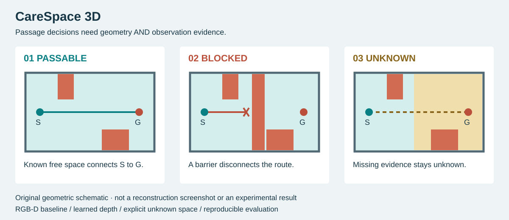

# CareSpace 3D

**看得見房間，不代表已有足夠證據確認通路。**

面向居家照護情境的 3D 空間重建與幾何通行研究工作台。從有限的合成觀測建立
有尺度的空間證據，對照 RGB-D 與學習式深度，互動分析 **可通行 · 阻斷 · 未知**。

**Python · PyTorch · DA3METRIC-LARGE · Three.js**

本機 CPU 端到端實作完成；Colab CPU 重現與三案例展示已有輸出及截圖驗收。

Repository 已建立並維持私人；目前沒有公開部署。

[三分鐘展示](docs/demo-guide.md) · [實驗結果](docs/results.md) · [安裝與重現](docs/reproduction.md) · [Colab 啟動指南](docs/colab-start-here.md)



*原創概念示意，不是實驗截圖；實際數值見下方比較。*

## 同樣 8 張觀測，為什麼判定不同？

在同一個開放通道、相同端點及半徑下：

| 重建方法 | 融合影格 | 已觀測比例 | 通行判定 |
|---|---:|---:|---|
| RGB-D · 全部觀測 | 24 | 93.3% | **可通行** |
| RGB-D · 固定間隔 | 8 | 81.0% | **未知** |
| RGB-D · 覆蓋選樣 | 8 | 92.8% | **可通行** |
| DA3 Metric · 全部觀測 | 24 | 92.5% | **阻斷** |

觀測位置影響能否建立連續的自由空間證據；學習式深度即使有尺度，也可能把開放通道重建成阻斷。
工作台把這些差異留在同一個幾何分析流程中，讓結果可對照、可追溯。

這是受控小樣本實驗。覆蓋選樣事先讀取候選 RGB-D，只節省融合用量；
不宣稱節省拍攝成本。DA3 的阻斷是保留的負例，不是實際通道真值。
[完整結果與分母定義 →](docs/results.md)

## 可以操作什麼

- **切換三個情境**：通道開放、沙發移至通道、觀測不足，對照可通行／阻斷／未知。
- **改變查詢**：設定 S/G 端點與圓柱半徑，重新計算路徑；保存的研究比較表維持原始條件。
- **檢查重建證據**：俯視、點雲、未知區與狹窄帶；完整參考幾何另行標示。
- **追查模型分歧**：配對相同觀測的 RGB-D／DA3，從差異格回看 RGB、深度與障礙支援。

目前提供本機及 Colab 內嵌工作台，沒有公開線上 demo。
[操作流程與預期畫面狀態 →](docs/demo-guide.md)

## 從觀測到判定：每一層都有明確責任

| 階段 | 實作 | 關鍵工程選擇 |
|---|---|---|
| 場景與觀測 | 程式化房間、原尺度家具、RGB-D、相機內外參 | 家具配置變更會更新場景與觀測身分 |
| 深度來源 | 合成 RGB-D 基線／實際 DA3METRIC-LARGE 推論 | DA3只讀RGB＋K；融合另使用已知相機姿態 |
| 幾何融合 | 像素射線累積到0.10m體素 | 未觀測保持unknown，occupied優先 |
| 通行分析 | 高度欄證據、圓柱足跡膨脹、四鄰接搜尋 | 區分已知自由通路、證實阻斷及待觀測候選路線 |
| 評估與展示 | 獨立oracle、三態矩陣、互動Three.js viewer | 參考幾何不進入重建推論；外觀不代替碰撞證據 |

[設計與資料契約](docs/design.md) · [核心程式](src/carespace) · [前端](viewer) · [測試](tests)

## 深度：不只接上一個模型

**尺度與資訊邊界。** 固定模型與程式revision、核對官方focal/300尺度轉換，
不以真值深度擬合尺度冒充部署能力。[尺度核對](docs/da3-audit.md)

**幾何更新與可恢復執行。** 場景、觀測、模型及重建revision不一致時拒用舊結果；
逐影格快取支援恢復，保存失敗與時間記錄。[重現流程](docs/reproduction.md)

**能解釋負結果。** DA3在正常通道誤判阻斷；追查單影格障礙支援，再用固定規則
將低支援障礙降為未知，仍未恢復正常通路。負結果與決策覆蓋代價都保留。
[深度診斷](docs/depth-audit.md) · [探索性負結果](docs/abstention.md)

**不靠全部拒絕取得漂亮數字。** 同時報錯放／oracle阻斷與錯放／預測放行，
並列未知比例及決策覆蓋。沒有放行時，後者為N/A。
[評估結果](docs/results.md)

## 重現與驗證

| 證據 | 已完成範圍 |
|---|---|
| 本機測試 | Python 29項；前端14項，涵蓋未知處理、幾何邊界、失敗記錄與互動狀態等 |
| Colab CPU | Python 3.11.15，29項測試通過；研究結果與三案例展示由使用者輸出／截圖確認 |
| 資料與模型 | 約8.67MB家具子集、單一1.34GB checkpoint；固定來源revision與SHA256 |
| 可追溯交付 | 來源ZIP與原始碼逐檔比對；數據、權重與環境不放入原始碼包 |

Colab證據不是獨立下載核對全部雲端檔案；GPU效能、真實觸控、讀屏及200%縮放仍未完整驗證。
[驗收紀錄與範圍 →](docs/verification.md)

已有環境與研究資料時，在專案根目錄執行：

```powershell
./scripts/serve.ps1
```

開啟 [本機工作台](http://127.0.0.1:8840/viewer/)。全新環境請依
[完整安裝與資料生成步驟](docs/reproduction.md)，或使用
[CareSpace3D CPU Colab notebook](notebooks/CareSpace3D_CPU_Reproduction_v1_1.ipynb)。
來源程式庫不內含資料與權重；不是clone後就已有研究成果的靜態網站。

## 研究邊界與來源

第一版使用半徑0.30m、高1.20m直立圓柱、平坦已知支撐面及已知合成相機姿態。
不是完整輪椅通行證據、醫療器材、無障礙認證或長者安全保證。

三個evaluation配置共享房間與家具，不是三個獨立家庭；未宣稱未知場景泛化。
ReplicaCAD固定版本LICENSE與官網標示存在差異，目前依較嚴格的本機非商業條件處理，
不在此提供家具資料、權重或派生場景下載。原創程式、文件與此概念示意採 [MIT](LICENSE)；第三方材料另依 [授權範圍說明](THIRD_PARTY_NOTICES.md)。

[來源與授權記錄](docs/sources.md) · [失敗紀錄](docs/failure-log.md) · [專案狀態](docs/publication-preparation.md) · [文件索引](docs/README.md)
