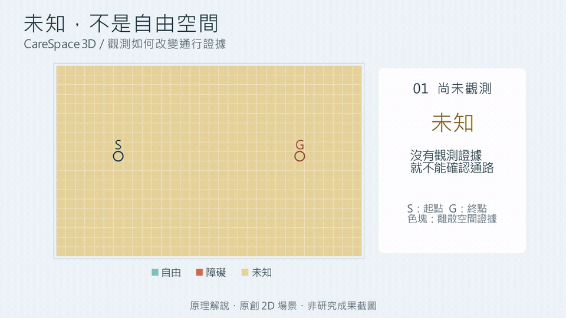

# CareSpace 3D

**從有限觀測重建室內空間，分析有證據支持的通行路徑。**

面向居家照護情境的 3D Vision 研究工作台，整合 **RGB-D 幾何重建、DA3 深度估計與互動通行分析**。
選擇端點與移動物體尺寸，即可查看自由空間、障礙、未知區域，以及 **可通行／阻斷／未知** 三態判定。

*Manim 原理解說：未知 → 補足觀測 → 確認通路。原創 2D 場景，非研究成果截圖。*

## 觀測如何影響通行判斷

同一開放通道、相同端點與半徑，改變觀測方式就會改變判定：

| 方法 | 融合影格 | 已觀測比例 | 判定 |
|---|---:|---:|---|
| RGB-D · 全部觀測 | 24 | 93.3% | 可通行 |
| RGB-D · 固定間隔 | 8 | 81.0% | 未知 |
| RGB-D · 覆蓋選樣 | 8 | 92.8% | 可通行 |
| DA3 Metric · 全部觀測 | 24 | 92.5% | 阻斷 |

**相同 8 張觀測，選樣方式影響通路證據；24 張學習式深度，也可能錯誤阻斷開放通道。**
本專案保留 DA3 負例，追溯深度與障礙來源，讓重建品質和通行判斷能被一起檢驗。
覆蓋選樣會先讀取候選 RGB-D，此處只比較融合用量，不代表節省拍攝成本。

## 技術實作

- **有尺度的幾何證據**：從像素射線融合 0.10 m 體素，保留 free／occupied／unknown；未觀測區域不當成自由空間。
- **公平的模型對照**：RGB-D 與 DA3METRIC-LARGE 共用融合及規劃流程；明列相機資訊，完整幾何只作獨立參考評估。
- **可追溯的工程流程**：場景變更使舊觀測與快取失效；模型 revision、SHA256、逐影格快取與失敗紀錄支援重現及恢復。
- **可操作的 3D 工作台**：Three.js 呈現點雲、路徑與差異圖層，支援端點、半徑、觀測方法及 RGB／深度預覽切換。

`Python` · `PyTorch` · `DA3METRIC-LARGE` · `NumPy / SciPy` · `Three.js`

## 執行與驗證

本機 **29 項 Python 測試、14 項前端測試通過**；**Colab CPU** 已完成安裝、研究流程與三案例展示驗收。
提供正常通道、家具阻斷及觀測不足案例，保存實驗結果與互動查詢分開呈現。

可在本機或 Colab 啟動；資料與單一 checkpoint 由腳本取得，目前沒有公開線上 demo。

[開始使用](docs/reproduction.md)　·　[實驗結果](docs/results.md)　·　[技術文件與驗收](docs/README.md)

---

**研究範圍**：受控合成房間、已知相機姿態、半徑 0.30 m／高 1.20 m 直立圓柱與平坦支撐面。
三個評估配置共享房間及家具，不代表獨立家庭泛化、完整輪椅通行或長者安全驗證；GPU 效能未驗證。

原創程式與概念圖採 **MIT**。ReplicaCAD 固定版本與官網授權標示有差異，依較嚴格條件處理；
資料、權重與派生場景不隨 repo 發布，第三方範圍見根目錄 `THIRD_PARTY_NOTICES.md`。
