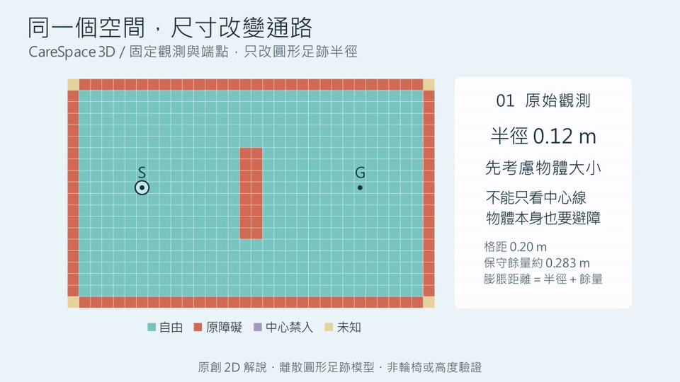

# 從觀測到通路：Manim 原理解說

以 Manim Community 0.20.1 製作正體中文原理解說。影片使用原創 2D 平面格與射線，
沒有 ReplicaCAD 資料、模型權重或研究影格；不是實驗截圖或新的重建成效。

| 動畫 | 說明 | 影片 |
| --- | --- | --- |
| 未知不是自由空間 | 25.6 秒：補上觀測，候選路線才成為確認通路。README 的主動畫。 | [MP4](../docs/media/unknown-space.mp4) |
| 同一個空間，尺寸改變通路 | 24.8 秒：固定觀測與端點，只改圓形足跡半徑。 | [MP4](../docs/media/footprint-radius.mp4) |



## 重現（Windows / CPU）

從專案根目錄執行，不要安裝進既有 `.venv`：

```powershell
uv venv --python 3.11.15 .venv-manim
uv pip install --python .venv-manim/Scripts/python.exe -r animations/requirements.lock
.venv-manim/Scripts/python.exe animations/render.py
.venv-manim/Scripts/python.exe animations/render.py footprint-radius
```

需要PATH上的FFmpeg；使用Windows內建Microsoft JhengHei字型，不分發字型檔案。
Cairo renderer使用CPU，不啟用OpenGL，無LaTeX需求。其他OS須提供相容字型並調整FONT；
本次只在Windows驗證。Manim在獨立環境的NumPy/SciPy版本與研究環境不同，不改研究鎖定檔。

兩個命令分別輸出 `docs/media/unknown-space.*` 與 `docs/media/footprint-radius.*`。
MP4 為 1280×720、30fps；GIF 為 960×540、10fps；中間檔只存 artifacts/manim。
使用 CPU，每支預留約 1～3 分鐘渲染；安裝時間另計，速度隨處理器而異。

## 計算與視覺界線

- `evidence_story.py`：32×20格、格距0.2m、中央障礙；每視角720條射線，遇首個障礙停止。
  每0.15格取樣是解說用2D觀測模型，不是生產RGB-D像素／高度融合。
- `unknown_space.py`：Manim只畫格子、抽樣射線、文字與路徑，不做判定。
- 共用 `src/carespace/planning.py` 的analyze、inflated_states與bfs。
  圓形半徑0.12m，加上既有保守離散化膨脹；虛線為允許未知的候選通路，
  實線只在已知自由膨脹網格連通後出現。不驗證輪椅、真實場景或高度淨空。
- 初始／第一視角／第二視角：unknown／unknown／passable；未知格640／232／4。
  剩餘未知格位於場域四角（網格索引 0/31 × 0/19），不因動畫結束而強制補滿。
- 可見動畫射線是720條射線的抽樣，用於解說；格子證據使用完整射線集合。

## 尺寸動畫的固定條件

`footprint_story.py` 沿用第一支最後的觀測網格與 S/G；`footprint_radius.py` 只負責呈現。
三次查詢不改觀測、不移家具，也不重新生成場景。橘色是原始障礙，紫色是原本自由、
經膨脹後中心不可進入的格子；金色保留未知。圓圈按照地圖比例顯示實際足跡半徑。

| 半徑 | 判定 | 中心禁入格數（含原始障礙） |
| --- | --- | ---: |
| 0.12 m | 可通行 | 336 |
| 0.25 m | 可通行 | 344 |
| 0.35 m | 阻斷 | 444 |

沿用規劃器的膨脹距離 `radius + sqrt(2) × resolution`，0.20 m 網格的保守餘量約
0.283 m；同時膨脹障礙與場域邊界，未知也會限制中心可用空間。
動畫在三個離散半徑間切換，不宣稱 0.35 m 是精確通行臨界值。
它說明的是此網格、餘量與圓形模型下的連通性，不是實體門寬或完整輪椅判定。

## 來源

Manim Community 0.20.1（PyPI），程式為MIT授權；官方專案
https://github.com/ManimCommunity/manim/tree/v0.20.1 。安裝相依固定在requirements.lock。
完整渲染環境與產物 SHA256 見 provenance.json；尺寸動畫見 footprint-provenance.json。
原創動畫程式與輸出適用本專案 MIT。
Manim／依賴的上游授權不因輸出授權而改變，不複製3Blue1Brown影片或素材。

## 驗收

觀測程式執行前置斷言：射線不把障礙標為自由、既有障礙不被新視角消除、
第一視角終點仍未知、第二視角通路由既有規劃器產生。抽查開頭、遮擋、
補觀測與結尾畫面，確認正體中文字、圖例、S/G、候選虛線及實線。
這是原理解說，不改動artifacts/study.json，也不增加新模型實驗。

尺寸動畫額外驗證：觀測陣列未改動、禁入格隨半徑單調增加、三次查詢的端點皆自由、
每條輸出路徑只走膨脹後的自由格且使用四鄰接。兩個獨立 Python 環境均執行相同檢查。
