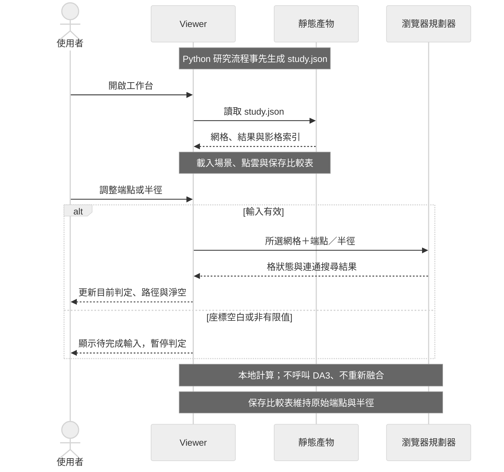

# Viewer artifact contract v1

## 互動查詢的執行邊界

研究流程先產生靜態結果；瀏覽器載入後，調整端點或半徑只更新目前查詢。
圖中的 Viewer 與規劃器是同一瀏覽器中的 JavaScript 模組，不是遠端服務。

對應 `viewer/app.js` 的載入與 `replan()`，以及 `viewer/planning.js` 的 `stateLookup()`／`bfs()`。
淨空由 Viewer 根據路徑另行計算；未知只顯示候選虛線，淨空留空。
切到 oracle 參考模式只改視覺對照，查詢仍用所選方法的重建網格。
家具配置切換是載入已重新生成的案例；任意家具編輯與線上重新重建不在本版功能內。

## 產物契約

Fetch `/artifacts/study.json`. Top level: {schema_version:1, body:{radius:0.3,
height:1.2, assumption:string}, cases:[Case], learning_status:string}.
Case: {id, title, description, split, family, scene_id, bounds:[xmin,zmin,xmax,zmax],
resolution:0.1, shape:[nx,nz], reference_mesh:string|null, methods:[Method], frames:[Frame]}.
Method: {id, label, states:number[] (flattened x-major nx*nz, -1 unknown/0 free/1 occupied),
points: {positions:number[] (xyz), colors:number[] (rgb 0..1)}, selected_frames:number[],
result: {status:'passable'|'blocked'|'unknown', path:[[x,z],...], start:[x,z],goal:[x,z],
clearance_m:number|null, reason:string}, metrics:object}.
Frame: {rgb:string,depth_preview:string,position:[x,y,z],id:number}.
Reference mesh is GLB opt-in, full source geometry, NEVER labeled reconstruction.
Grid lies at y=0.02, Y up. Draw unknown visibly. Method points represent observed surfaces.

Implement browser replan from states for endpoints/radius: any occupied footprint cell
blocks, any unknown footprint cell makes center unknown; pad outside as blocked; disk
threshold radius+sqrt(2)*resolution (same conservative margin as Python). Four-neighbor
BFS path in free, then optimistic free+unknown. Path clearance is nearest non-free cell
(unknown or occupied) or padded boundary distance minus half-cell diagonal.
Start/end click controls plus numeric fields/keyboard. Before/after is case selection,
never move geometry without regenerating artifacts. Static persisted cases are sufficient.
All files local; dependency three==0.174.0 npm; no CDN, servers, frameworks or deployment.
Palette: #eaf0f4 canvas, #152f43 ink, #117d83 free, #d66750 obstacle, #c19b43 unknown,
#ffffff panels. Type: system UI/Microsoft JhengHei and monospace measurements.
Chinese UI, compact professional spatial research tool, centerpiece 3D, no marketing hero.
Show radius/height assumptions and known-pose mode, reconstructed vs oracle clearly.
Show all metrics available, optional frames, mode and observation count controls.
Loading/error/empty states, labels, focus styles, responsive; capture UI after real data.

Final UI: obstacle grid is shown as 0.12 m projection columns, not reconstructed
height. Points preserve observed surface coordinates; purple narrow bands mean fixed
radius clearance [0.30,0.60) m to known obstacles/boundary, unrelated to clinical rules.
Frame dialog uses learned_depth_preview only for DA3, and declares missing outputs.
Browser BFS checks start/goal admissibility before exploring; unknown candidate paths
are colored unknown and never described as a passable path. Saved comparison rows
retain original experiment endpoints/radius; interactive replan is separately labeled.

Refinement: neutral blue-gray point display improves contrast without changing point
coordinates; sensor RGB remains in frame previews and artifact colors. Unknown candidate
paths are dashed and their lengths explicitly labeled candidate lengths. Endpoint circles
show the chosen radius (the extra planner discretization margin is not drawn). Typed
coordinates retain their precision; blank/non-finite coordinates suspend the verdict.
Method switches retain the current query; case changes reset endpoints, and the explicit
reset action restores endpoints plus study radius. Reference mode overlays geometry but
the active method's reconstruction grid remains the only browser-planning input.
Three.js redraws on changes/resizes and while OrbitControls damping settles, then stops.
Stale GLTF callbacks are invalidated by content revision and dispose their whole hierarchy.

First-visit interaction revision (2026-09-10):
- DOM reading/focus order is query conditions, current result, 3D, advanced query,
  saved method comparison, research evidence. One instance of each control across sizes.
- Default mode is browse. Canvas wheel scrolls the page and ground clicks do not edit
  endpoints. Explicit camera mode enables OrbitControls; completion or Escape returns
  to browse. Start/goal edit mode alone enables ground placement and focused-viewport
  arrow keys. A successful ground placement exits edit mode; a drag over 5 px does not
  place an endpoint. Case changes and explicit reset return to browse.
- Current case/method/source/radius appear in a summary. Baseline label is computed
  from actual radius/start/goal against the selected method's saved query. Invalid
  coordinates show pending input; reset provides live confirmation. Changing cases
  retains radius but resets to the first method and saved endpoints; changing methods
  preserves query coordinates/radius. Saved comparison rows remain fixed experiment data.
- Main verdict uses plain language; expanded rationale retains geometry assumptions
  and distinguishes endpoint/boundary blockage from disconnected paths. All passable
  labels consistently say 可通行. All observations means all saved frames for this case,
  not full spatial coverage.
- View controls, interaction hint and legends sit outside the canvas. Point cloud is
  initially on; disabling it improves floor/path readability without changing evidence.
- A single native frame dialog shows RGB/depth side by side above 700 px; below that,
  pressed-state buttons select one image. Every new frame opens on RGB. Header/close
  remain sticky; method and frame labels, sensor/predicted depth routing, missing
  preview state and native Escape/focus return are preserved.

Typography follow-up (2026-09-10):
- Viewer text has a 16 px minimum at desktop and mobile sizes, including form controls,
  hints, legends, method tables, frame labels, dialog captions and footer.
- Compact page/panel spacing and a bounded scene height avoid stretching the canvas
  to match long evidence panels. Longer condition explanations live in query details.
- Tables keep local horizontal scrolling; type is never reduced to force columns to fit.
- Frame labels sit outside thumbnail images, retaining readable RGB/depth identities.

Second-round follow-up (2026-09-10):
- Explicit S/G buttons alone call beginEndpointEdit. Entering an edit brings an
  off-screen canvas into view and focuses it with preventScroll; an already visible
  canvas stays in place. A repeated selection exits without requesting a scroll.
  Generic mode changes, reset and Escape do not request navigation.
- One live mode hint describes the current interaction. Legends and line meanings
  remain visible; native layer details hold point-cloud and difference explanations.
- Difference availability reuses chooseBaseline and endpoint validation, including
  diagnostic failures. Its local description reports the unavailable reason or
  current pairing and keeps the distinction between disagreement and oracle error.
